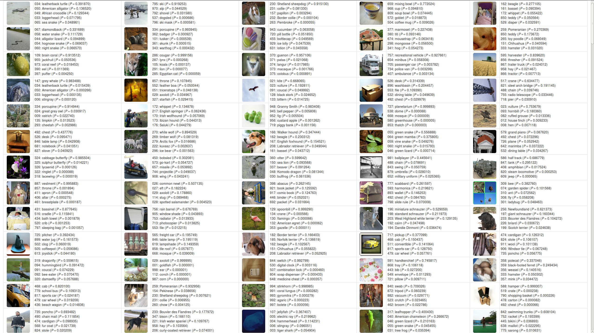

# Instant Espresso

The powerful Berkeley Caffe framework has become the standard implementation of training and testing of deep neural networks, but it can seem hard to install and use, especially to people from backgrounds other than computer science, even if they oftentimes only need the classification results or feature vectors from the Caffe network on a handful of images, instead of training an entirely new network.

Motivated by such needs, we implemented a Caffe-compatible feature extraction engine, i.e. feedforward pass of Caffe, in 35 lines of Python (more specifically NumPy and SciPy), which can in theory support most of the commonly seen pre-trained networks (except GoogLeNet for now).

Though being simple and concise, our implementation still runs reasonably fast while using less memory, thanks to NumPy's powerful data structure, ndarray, which supports highly flexible indexing and striding methods without actual memory copying.
For example, <code>im2col</code> in Numpy can be done in one line, without blowing up the memory usage.
When running in batch mode (i.e. multiple images in one input stack), our implementation can classify around 15 images per second on modern CPUs if configured correctly, e.g., using the Anaconda/Miniconda Python distribution.

Our implementation blends features from both Caffe and MatConvNet, which make the code simple and efficient, and the network naturally fully convolutional. 
Though it's totally possible to incorporate other advanced Python libraries (e.g. Theano, Numexpr, Numba, Parakeet, etc.) to make it run faster, we decided to keep it as simple as possible, which we believe may benefit the general users more.
While converting a pre-trained Caffe network into our format can as well be done with tools in <code>utils</code> modified from the MatConvNet library, a pre-converted example of Caffe reference network is available (see below).

## Usage

Download this repository and the pre-converted Caffe reference network [<code>refnet.pkl.zip</code>](https://www.dropbox.com/s/ne4kzj0dzyzvvdz/refnet.pkl.zip).
Worth to note, pickle files can be insecure especially when downloaded from unknown sources.
Make sure you download it from the link specified above, and check if the md5sum of <code>refnet.pkl.zip</code> is <code>d19d1800a3f4560cb1546d91b253f7d3</code>.

Once you have everything, you can specify the dataset you want to classify in <code>demo.py</code> and run it with <code>python -W ignore demo.py</code> which in the meantime suppresses warnings from SciPy.
You should be able to find <code>results.html</code> after it finishes, which summaries the labels of all images.

Though not directly supported in <code>demo.py</code>, it shouldn't be hard at all to collect the feature vectors computed by a Caffe network.
For example, by simply stripping the last layer of the Caffe reference network, one can observe the nice "semantic structures" in Caffe features, suggesting the network is doing things right.
As reported by [Razavian et al.](http://arxiv.org/pdf/1403.6382.pdf), features directly derived from modern deep networks can often serve as surprisingly good off-the-shelf representations for images to be classified in various recognition tasks, which also motivated the creation of this project.

Downloading and converting the Caffe reference network can also be done through <code>import-ref-models.sh</code> in <code>utils</code>.
However, you may need to install other Python libraries to run it.
Please refer to the [MatConvNet repository](https://github.com/vlfeat/matconvnet) for more examples of converting other networks.
