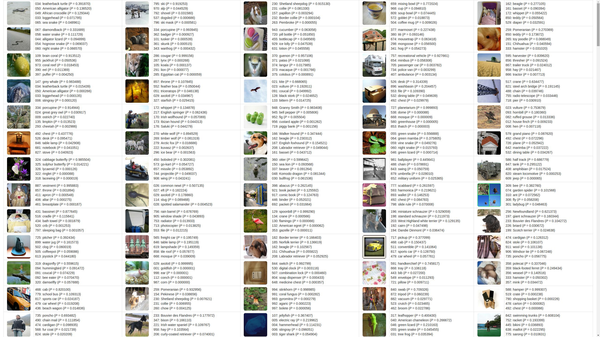

# Instant Espresso: Caffe-Compatible Feature Extraction Engine in 35 Lines of Python

While the Berkeley Caffe framework has literally become the standard reference implementation of training and testing deep neural networks, it can seem hard to install and use, especially to people from backgrounds other than computer science, even if they oftentimes only need the classification results or feature vectors from the Caffe network on a handful of images, instead of training an entirely new network.

Inspired by such needs, we implemented a Caffe-compatible feature extraction engine, i.e. feedforward pass of Caffe, in 35 lines of Python (more specifically NumPy and SciPy), which can in theory support most of the commonly used pre-trained networks (except GoogLeNet for now).

Though being simple and concise, our implementation still runs reasonably fast while using less memory, thanks to NumPy's powerful data structure, ndarray, which supports highly flexible indexing and striding methods without actual memory copying.
For example, im2col in our code is done in one line, without blowing up the memory usage.
When running in the batch mode (i.e. multiple images in one input stack), our implementation can classify around 15 images per second on modern CPUs if configured correctly using, e.g., the Anaconda/Miniconda Python distribution.

Our implementation blends features from both Caffe and MatConvNet, which make the code simple and efficient, and the network naturally fully convolutional. 
Though it's fully possible to incorporate other advanced Python libraries (e.g. Theano, Numexpr, Numba, Parakeet, etc.) to make it run faster, we decided to keep it as simple as possible, which we believe may benefit the general users more.
While converting of a pre-trained network into our format can be done with tools in <code>utils</code> modified from the MatConvNet library, a pre-converted example of Caffe reference network is also available (see below).

## Usage

Download or clone the repository, and download the [pre-converted Caffe reference network](https://drive.google.com/open?id=0B8LpM_21I0tYLVBSN0NoU0w3b1U).
Worth to note, pickle files can be insecure especially when downloaded from unknown sources.
Make sure you download it from the link specified above, and check if its md5sum is <code>d19d1800a3f4560cb1546d91b253f7d3</code>.

Once you have everything, you can specify the dataset you want to classify in <code>demo.py</code> and run it with <code>python -W ignore demo.py</code> which in the meantime suppresses negligible warnings from SciPy.
You should be able to find <code>results.html</code> after it finishes, which summaries the lables of all images.

Downloading and converting Caffe-compatible networks can be executed via <code>import-ref-models.sh</code> in <code>utils</code>.
However, you may need to install other Python libraries to run it.
Please refer to the [MatConvNet repository](https://github.com/vlfeat/matconvnet) for examples of converting other networks.

## License

You may need to check the license agreements from [MatConvNet](http://www.vlfeat.org/matconvnet/) and [Caffe](http://caffe.berkeleyvision.org/) for the conversion tools and pre-trained networks adopted in this work.
However, our Python codes (<code>convnet.py</code> and <code>demo.py</code>) are released for unrestricted use and distribution.
